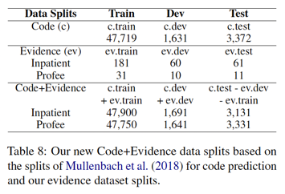

MDACE: MIMIC Documents Annotated with Code Evidence (ACL 2023)
==============================================================

This is the official repository for the dataset paper <br/>
**Title**: MDACE: MIMIC Documents Annotated with Code Evidence <br/>
**Authors**: Hua Cheng, Rana Jafari, April Russell, Russell Klopfer, Edmond Lu, Benjamin Striner, Matthew R. Gormley <br/>
**URL**: https://aclanthology.org/2023.acl-long.416/<br/>
**arXiv**: https://arxiv.org/abs/2307.03859 <br/>


[**M**IMIC **D**ocuments **A**nnotated with **C**ode **E**vidence](https://aclanthology.org/2023.acl-long.416/) is the first publicly available dataset for evidence/rationale
extraction on an extreme multi-label classification task over long medical documents. It is built on a subset of the
[MIMIC-III](https://physionet.org/content/mimiciii/) clinical records, and was annotated by professional medical
coders. MDACE consists of 302 Inpatient charts with 3,934 evidence spans and 52 Profee charts
with 5,563 evidence spans.

Usage
=====

This repo includes basic preprocessing and tokenization as well as an implementation of the metrics reported in the paper.

1. After gaining access to MIMIC III, download `NOTEEVENTS.csv` to this directory (unzip if necessary).
1. Inject text into our JSON files and write them to `with_text/gold/`

    ```shell
    python3 inject-note-text.py --noteevents NOTEEVENTS.csv \
                                --data-dir data/ \
                                --out-dir with_text/gold
    ```

1. _Train your model and generate predictions in the same format._
1. Inject text into predicted JSON files and write them to `with_text/predictions/`

    ```shell
    python3 inject-note-text.py --noteevents NOTEEVENTS.csv \
                                --data-dir predictions/ \
                                --out-dir with_text/predictions
    ```

1. Compute metrics for predictions given a split file and note category.

    - Supervised Attention

        ```shell
        python3 evaluate-predictions.py --split-file splits/Inpatient/MDace-ev-test.csv \
                                        --note-category "Discharge summary" \
                                        --gold-dir with_text/gold/Inpatient/ICD-9/1.0 \
                                        --predictions-dir with_text/predictions/supervised_attn/Inpatient/ICD-9/Discharge \
                                        --trim-annotations \
                                        --md-out results/supervised_attn/Inpatient/ICD-9/Discharge/results.md
        ```


    - Supervised Attention All Codeable Docs

        ```shell
        python3 evaluate-predictions.py --split-file splits/Inpatient/MDace-ev-test.csv \
                                        --note-category "Discharge summary" \
                                        --note-category "Radiology" \
                                        --note-category "Physician" \
                                        --gold-dir with_text/gold/Inpatient/ICD-9/1.0 \
                                        --predictions-dir with_text/predictions/supervised_attn/Inpatient/ICD-9/Codeable \
                                        --merge-adjacent \
                                        --trim-annotations \
                                        --md-out results/supervised_attn/Inpatient/ICD-9/Codeable/results.md
        ```

    - Unsupervised Atention


        ```shell
        python3 evaluate-predictions.py --split-file splits/Inpatient/MDace-ev-test.csv \
                                        --note-category "Discharge summary" \
                                        --gold-dir with_text/gold/Inpatient/ICD-9/1.0 \
                                        --predictions-dir with_text/predictions/unsupervised_attn/Inpatient/ICD-9/Discharge \
                                        --trim-annotations \
                                        --md-out results/unsupervised_attn/Inpatient/ICD-9/Discharge/results.md
        ```

Splits
======

The _splits_ directory contains the lists of MIMIC-III HADM IDs that were used to run our experiments.

- `MDace-ev-*.csv`: corresponds to the **Evidence** (middle) row in Table 8 of our paper.
- `MDace-code-ev-*.csv`: corresponds to the **Code+Evidence** (bottom) row in Table 8 of our paper.



Data
====

In addition to the MDACE dataset (`data/`), we also provide predictions from a few experiments in the paper (`predictions/`).

Directory Structure
-------------------

```
MDACE
├── data
│   ├── <Inpatient or Profee>
│   │   ├── <ICD-10 or ICD-9>
│   │   │   └── <version>
│   │   │       ├── *.json
├── predictions
│   ├── <experiment name>
│   │   └── <Inpatient or Profee>
│   │       └── <ICD-10 or ICD-9>
│   │           ├── *.json
```

Format
------

One file per chart (aka admission)

`<hadmid>.json`

```js
{
    "hadm_id": 380123,
    "comment": "EGD report not present- unable to validate the PCS codes"
    "notes": [
        {
            "note_id": 1234,
            "category": "Discharge Summary",
            "description": "Report",
            "annotations": <List of Annotations>
        },
        ...

    ]
}
```

`<List of Annotations>`

```js
[
    {
        "begin": 0,
        "end": 3,
        "code": "I10",
        "code_system": "ICD-10-CM",
        "description": "Essential (primary) hypertension",
        "type": "Human"
    },
    ...
]
```

Code Mapping Types
------------------

- Human: human annotation
- EXACT: Exact mapping from the human annotated ICD 10 code
- APPROX: Approximate mapping from the human annotated ICD 10 code
- MULTI: One to many mapping, then chosen by overlap with MIMIC codes
- MULTI_DESC: One to many mapping and no overlap with MIMIC codes, chosen by max token overlap in code descriptions.


Cite this Work
==============

```citation
@inproceedings{cheng-etal-2023-mdace,
    title = "{MDACE}: {MIMIC} Documents Annotated with Code Evidence",
    author = "Cheng, Hua  and
      Jafari, Rana  and
      Russell, April  and
      Klopfer, Russell  and
      Lu, Edmond  and
      Striner, Benjamin  and
      Gormley, Matthew",
    booktitle = "Proceedings of the 61st Annual Meeting of the Association for Computational Linguistics (Volume 1: Long Papers)",
    month = jul,
    year = "2023",
    address = "Toronto, Canada",
    publisher = "Association for Computational Linguistics",
    url = "https://aclanthology.org/2023.acl-long.416",
    pages = "7534--7550",
    abstract = "We introduce a dataset for evidence/rationale extraction on an extreme multi-label classification task over long medical documents. One such task is Computer-Assisted Coding (CAC) which has improved significantly in recent years, thanks to advances in machine learning technologies. Yet simply predicting a set of final codes for a patient encounter is insufficient as CAC systems are required to provide supporting textual evidence to justify the billing codes. A model able to produce accurate and reliable supporting evidence for each code would be a tremendous benefit. However, a human annotated code evidence corpus is extremely difficult to create because it requires specialized knowledge. In this paper, we introduce MDACE, the first publicly available code evidence dataset, which is built on a subset of the MIMIC-III clinical records. The dataset {--} annotated by professional medical coders {--} consists of 302 Inpatient charts with 3,934 evidence spans and 52 Profee charts with 5,563 evidence spans. We implemented several evidence extraction methods based on the EffectiveCAN model (Liu et al., 2021) to establish baseline performance on this dataset. MDACE can be used to evaluate code evidence extraction methods for CAC systems, as well as the accuracy and interpretability of deep learning models for multi-label classification. We believe that the release of MDACE will greatly improve the understanding and application of deep learning technologies for medical coding and document classification.",
}
```
